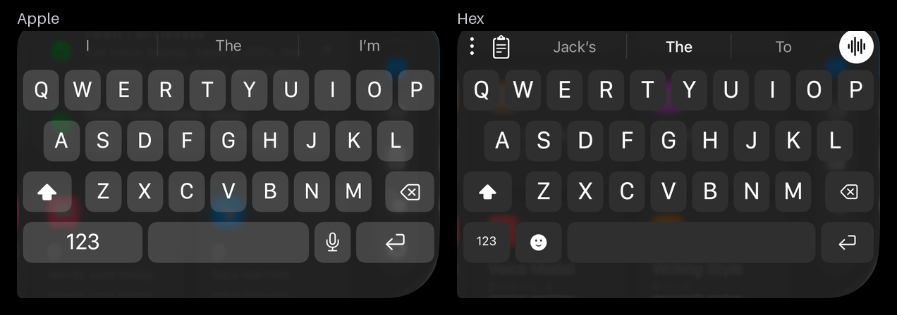
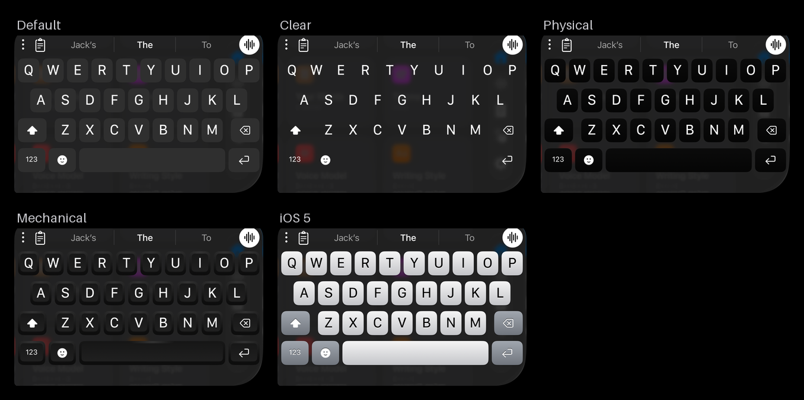
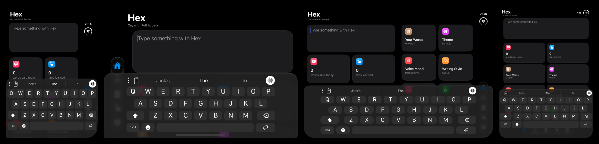
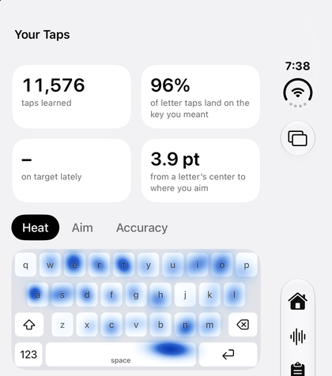
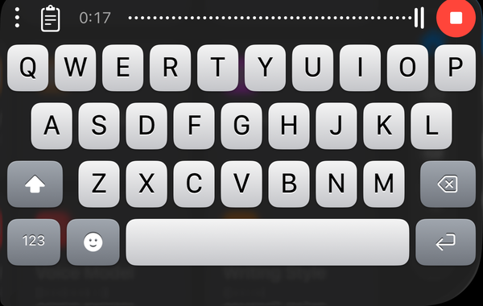

<h1>
  <picture>
    <source media="(prefers-color-scheme: dark)" srcset="brand/readme/header-dark.png">
    
  </picture>
</h1>

**An iPhone keyboard that types like Apple's and learns where your thumbs land.**

iikb types like Apple's keyboard and looks like Raycast's. It learns where each of your taps really lands, so it fixes more typos and leaves the words you meant alone.

It's open source under MIT, a base to build your own keyboard on. For iPhone and iPad on iOS 26 and later, and the iPhone Duo in every pose. Type with its engine in your browser at [iikb.vercel.app](https://iikb.vercel.app).

Apple's keyboard on the left, iikb on the right, on the iPhone Duo's cover:



## It feels like Apple's

Layouts, pop-ups, accents, the space bar cursor and the suggestion bar work as Apple's do, measured against Apple's keyboard in the same simulator on every iPhone and iPad size and each of the Duo's screens, in light and dark. Keys sit where Apple's do, except where the look moves them on purpose: Raycast's bottom-row widths, and on the Duo, keys that grow into the room each screen gives ([docs/design.md](docs/design.md) has every size). Haptics start at the strength Apple's keyboard uses, read off a real iPhone, with three steps softer and three stronger. Settings have Apple's names and defaults, except that auto-capitalization and auto-correction start off. Your Text Replacements still work.

## It looks like Raycast's

Raycast's five themes (Default, Clear, Physical, Mechanical and iOS 5), its key shapes, and one bar with the tools at its left and the mic at its end.



## Made for the iPhone Duo

iikb fits each of the Duo's screens: the cover upright and on its side, open and held wide or tall, and half folded. Open and held wide, hold 123 to split the keys for two thumbs. The app lays out every page for the screen it's on, in two panes beside the hinge when there's room.



## It learns where you tap

Each key remembers where your thumb really lands, from the words you keep and the letters you fix. If your grip changes, it catches up within a few taps. Autocorrect reads every tap with that in mind, and it only changes a word you spelled right when your taps fit another word better.

A test types 500 phrases twice with off-target thumbs. A keyboard that takes the nearest key and corrects with Apple's spell checker gets 85.2% of words right; iikb gets 97.6%. [PROGRESS.md](PROGRESS.md) has the numbers and how they're measured.

The suggestion bar guesses your next word from the two before it, and from what you usually type.

The app's Your Taps tab shows what it learned: a heat map of where your thumbs press, where each key's taps land, and the keys you miss most.

<picture>
  <source media="(prefers-color-scheme: dark)" srcset="docs/taps-dark.png">
  
</picture>

## Talk instead of typing

Tap the mic beside the suggestions. iOS doesn't let keyboards use the microphone, so the first time, iikb opens its app to start listening, then goes back to your app while you keep talking. The app can keep the mic on for as long as you pick, and while it's on, the mic starts and stops dictation right there, in any app; hold it to turn the mic off.

What you say becomes text on the iPhone, written by the voice model you pick in the app's Settings › Voice Model: NVIDIA's [Parakeet v3](https://huggingface.co/nvidia/parakeet-tdt-0.6b-v3) (the default) or moondream's [Parakeet Ultra](https://huggingface.co/moondream/parakeet-ultra), run on the Neural Engine by [FluidAudio](https://github.com/FluidInference/FluidAudio), or Apple's own. Parakeet v3 downloads once, about 500 MB; a dictation made while it gets ready is saved and written once it is. The Transcripts tab keeps every transcript, with the model that wrote it.



## Emoji

Type a word like "pizza" and its emoji shows up in the suggestion bar; tap it to swap the word for it. The emoji key beside the space bar opens every other emoji, the ones you've picked first, and the keys type into its search, which finds emoji by name and keyword. Hold one for its skin tones. Settings can take the key away, leaving the bar's emoji.

## Sources

A source is a web service you plug into the keyboard. iikb sends it the text of the field you're typing in, in any app, and it can answer with a hint that shows above the keys: a tone check before you send a text, a reminder, anything it can work out from what you're writing. Add one in the app, or by tapping the link it gives you. The API is one JSON request and answer, in [docs/sources.md](docs/sources.md). [`sources/record.ts`](sources/record.ts) is one you can run yourself: it keeps a log of every message you send.

## Also

- GIF search and your clipboard history, from the tools at the bar's left. The app's Clipboard tab shows the same history, pinned items first.
- A number row, Character Preview and skin tones, as Raycast's keyboard has.
- One-handed keyboard: hold 123 and slide left or right.
- Hold the space bar and slide to move the cursor, hold delete to erase whole words, flick down on iPad keys for their second character.
- Return, email, URL and search fields get the keys Apple gives them.
- iikb goes online only to download its voice model once, search GIFs and reach the sources you add. Without a source, nothing you type, say or copy leaves your iPhone.

Not built yet: swipe typing, and languages other than English.

## Install

iikb isn't on the App Store, so you build it yourself. The code and IDs still use the old name (the `Hex` scheme, `HexKeyboard`, `com.shahidy.hexkeyboard`, the `hexkeyboard://` links), so an existing install updates in place and keeps what it learned.

On a Mac, with Xcode and [XcodeGen](https://github.com/yonaskolb/XcodeGen):

```sh
xcodegen generate
open HexKeyboard.xcodeproj
```

Put your team in `Config/Team.xcconfig` (`DEVELOPMENT_TEAM = <your team ID>`) and run the `Hex` scheme. On Linux, `scripts/phone` builds and installs it with [AVGVSTVS96/xtool](https://github.com/AVGVSTVS96/xtool), a fork that keeps the app and App Group IDs (stock xtool installs a separate copy and drops the App Group); [AGENTS.md](AGENTS.md) has the details. A different team may need to swap in its own app and App Group IDs.

Then on the phone: Settings › General › Keyboard › Keyboards › Add New Keyboard… › iikb, and turn on Allow Full Access. iikb needs it for haptics, voice, GIFs, the clipboard, Your Taps and sources. The clipboard also needs Settings › Apps › iikb › Paste from Other Apps set to Allow.

## How it's built

| Path | What |
| --- | --- |
| `Packages/HexKeyboard/Sources/KeyboardCore` | Everything the keyboard does: layouts, typing, autocorrect, the tap model, emoji search. Pure Swift with no Foundation or UIKit, so it also runs in the browser as WebAssembly. Unit tested. |
| `Packages/HexKeyboard/Sources/KeyboardUI` | Draws the keys, handles touches and haptics, and talks to the app. |
| `Keyboard/` | The keyboard extension. |
| `App/` | The app: setup and settings, voice typing, Transcripts, Clipboard and Your Taps. |
| `web/` | The browser demo. |
| `UITests/` | Types through the real keyboard in the simulator. |
| `brand/`, `copy/` | The logo, README header and site images, and the words they use. `bun copy/facts.mjs` counts every number the copy cites. |

Tests:

```sh
scripts/coretest   # KeyboardCore's tests on Linux, no Mac needed (about 25 s)
scripts/test       # on a Mac: KeyboardCore and KeyboardUI on an iPhone 17 simulator, without the slow autocorrect scorer
scripts/uitest     # on a Mac: types through the real keyboard
```

[AGENTS.md](AGENTS.md) explains the design and the scripts; [PROGRESS.md](PROGRESS.md) is the build log, with every measurement.

## License

MIT. See [LICENSE](LICENSE).
